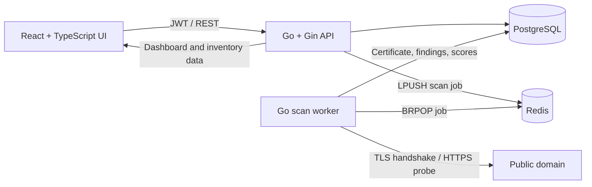

# QuantumField

**TLS, PKI & Crypto-Risk Intelligence Platform**

[](https://github.com/Prathyusha2909/quantumfield/actions/workflows/ci.yml)


QuantumField inventories internet-facing TLS certificates, turns protocol and PKI weaknesses into prioritized findings, and adds a rule-based crypto-agility assessment for future cryptographic migrations.

> **Project maturity:** portfolio-grade security engineering prototype with an explicit production-hardening roadmap. It is not presented as a production security service.

## Scope and honest positioning

QuantumField performs TLS/PKI discovery and risk analysis. Its crypto-agility score can help organize a future post-quantum migration backlog, but the project does **not** implement:

- ML-KEM/Kyber key exchange;
- ML-DSA/Dilithium signatures;
- hybrid post-quantum TLS;
- post-quantum X.509 certificates;
- a production CA, HSM, or standards-compliant PQC cryptosystem.

The scoring engine is deliberately deterministic and explainable. There is no AI model hidden behind the score, and the repository should not be described as an AI project.

## Why this project exists

Most TLS tools stop at “valid” or “expired.” QuantumField connects three concerns that security teams increasingly need to manage together:

- operational TLS hygiene: expiry, trust chain, hostname coverage, HSTS, protocol versions, and key strength;
- PKI inventory: issuer, subject, SANs, serial number, fingerprint, signature algorithm, public-key algorithm, and lifecycle;
- crypto agility: classical RSA/ECC dependency, TLS 1.3 adoption, legacy protocol removal, and certificate rotation readiness.

This makes the project interview-defensible: it performs real network inspection, processes jobs asynchronously, persists evidence, applies explicit scoring models, and presents results in an analyst-focused dashboard.

## Architecture



### Scan lifecycle

1. An authenticated user adds a fully qualified domain and TLS port.
2. The API creates a `queued` scan and pushes a job into Redis.
3. The worker resolves the target and rejects private/reserved network destinations.
4. It retrieves the certificate chain, then verifies trust and hostname coverage independently.
5. Additional probes inspect the negotiated TLS version, cipher suite, TLS 1.0/1.1 acceptance, and HSTS.
6. The scoring engine creates findings, a 0–100 risk score, and a 0–100 crypto-agility score.
7. PostgreSQL stores immutable scan evidence and updates the asset’s current posture.

## Features

- JWT registration, login, session restoration, and tenant-scoped data access
- analyst/admin role claims and reusable role middleware
- domain inventory with labels, ports, status, and scan history
- Redis-backed asynchronous scan queue with a separately scalable worker
- Redis-backed IP/user rate limits for authentication and scan-trigger routes
- retry-aware scan execution with persisted attempts, terminal failures, and error reasons
- versioned, transactional PostgreSQL migrations and query-focused indexes
- audit logging for login attempts, asset creation, scans, failures, and report exports
- X.509 subject, issuer, CN, SAN, serial, validity, fingerprint, key/signature algorithms, and key size
- independent certificate-chain and hostname validation
- TLS version, cipher suite, TLS 1.0/1.1, and HSTS inspection
- persisted findings with severity, evidence, and remediation
- explainable risk and crypto-agility readiness models
- dashboard, asset drill-down, scan jobs, findings, certificate inventory, crypto-agility readiness, and reports
- JSON report export
- Docker Compose, GitHub Actions, and an optional Kubernetes template
- weekly Dependabot monitoring for Go, npm, GitHub Actions, and container dependencies
- resolve-once DNS pinning that blocks loopback, private, link-local, multicast, documentation, benchmark, and reserved networks

## Technology

| Layer | Technology |
|---|---|
| API and worker | Go 1.23, Gin, GORM |
| Durable data | PostgreSQL 16 |
| Job queue | Redis 7 |
| Authentication | JWT HS256, bcrypt |
| Scanner | Go `crypto/tls`, `crypto/x509`, `net/http` |
| Frontend | React 18, TypeScript, Vite, Tailwind CSS |
| Runtime | Docker Compose, Nginx |
| CI | GitHub Actions |
| Optional deployment | Kubernetes |

## Quick start with Docker

Requirements: Docker Engine and Docker Compose v2.

```bash
cp .env.example .env
docker compose up --build
```

Open:

- UI: <http://localhost:3000>
- API health: <http://localhost:8080/health>

When `SEED_DEMO=true`, the development-only account is:

```text
demo@quantumfield.dev
QuantumField123!
```

Change `JWT_SECRET`, the database password, and the demo setting before any shared deployment.

## Demo status

No hosted deployment is currently claimed. Run the Compose stack for the live application. A short, reproducible recording plan is available in [docs/DEMO.md](docs/DEMO.md); add a real GIF or MP4 link only after recording the running application.

The repository intentionally does not substitute generated UI mockups for evidence from a running system.

## Local development

Requirements: Go 1.23+, Node.js 22+, PostgreSQL, and Redis.

```bash
# Terminal 1
cd backend
go mod download
go run ./cmd/api

# Terminal 2
cd backend
go run ./cmd/worker

# Terminal 3
cd frontend
npm install
npm run dev
```

For host-run services, set `DATABASE_URL` and `REDIS_ADDR` to localhost values. Vite proxies `/api` to `http://localhost:8080`.

## Configuration

| Variable | Default | Purpose |
|---|---|---|
| `DATABASE_URL` | local development URL | PostgreSQL DSN |
| `REDIS_ADDR` | `localhost:6379` | Redis host and port |
| `REDIS_PASSWORD` | empty | Optional Redis password |
| `REDIS_DB` | `0` | Redis logical database |
| `JWT_SECRET` | development value | JWT signing secret; use 32+ random characters |
| `JWT_TTL_HOURS` | `24` | Access-token lifetime |
| `API_PORT` | `8080` | API listen port |
| `CORS_ORIGINS` | `http://localhost:5173` | Comma-separated browser origins |
| `SCAN_TIMEOUT_SECONDS` | `15` | Per-network-operation timeout |
| `MAX_SCAN_RETRIES` | `3` | Number of retries after the first failed scan attempt |
| `SEED_DEMO` | `false` | Create the development demo account |
| `TRUSTED_PROXIES` | empty | Comma-separated proxies allowed to supply client IP headers |
| `VITE_API_URL` | `/api` | Frontend API base URL |

## API

All protected routes require `Authorization: Bearer <jwt>`.

### Authentication

| Method | Endpoint | Description |
|---|---|---|
| `POST` | `/api/auth/register` | Create an analyst account |
| `POST` | `/api/auth/login` | Issue a JWT |
| `GET` | `/api/auth/me` | Return the current user |

### Assets and scans

| Method | Endpoint | Description |
|---|---|---|
| `POST` | `/api/assets` | Add a domain and TLS port |
| `GET` | `/api/assets` | List the user’s assets |
| `GET` | `/api/assets/:id` | Asset details and scan history |
| `DELETE` | `/api/assets/:id` | Soft-delete an asset |
| `POST` | `/api/assets/:id/scan` | Queue a TLS scan |
| `GET` | `/api/scans` | List scan jobs |
| `GET` | `/api/scans/:id` | Full scan evidence |

### Intelligence

| Method | Endpoint | Description |
|---|---|---|
| `GET` | `/api/assets/:id/certificate` | Latest asset certificate |
| `GET` | `/api/assets/:id/findings` | Asset finding history |
| `GET` | `/api/assets/:id/pqc-assessment` | Latest asset assessment |
| `GET` | `/api/certificates` | Portfolio certificate inventory |
| `GET` | `/api/findings` | Portfolio findings; optional `severity` query |
| `GET` | `/api/pqc-assessments` | Portfolio readiness history |
| `GET` | `/api/dashboard` | Dashboard aggregates |
| `GET` | `/api/reports/summary` | Reporting aggregates |
| `GET` | `/api/reports/export` | Audited JSON report export |
| `GET` | `/api/audit-logs` | User-scoped security audit history |

Example:

```bash
curl -X POST http://localhost:8080/api/assets \
  -H "Authorization: Bearer $TOKEN" \
  -H "Content-Type: application/json" \
  -d '{"domain":"example.com","port":443,"label":"Public website"}'
```

## Data model

| Entity | Important fields | Relationship |
|---|---|---|
| `users` | name, email, password hash, role | owns assets |
| `assets` | domain, port, status, current risk/agility scores | belongs to user; has scans |
| `scans` | status, timing, TLS evidence, scores, retry/error state | belongs to asset |
| `certificates` | identity, issuer, validity, algorithms, fingerprint, validation | one per completed scan |
| `findings` | type, severity, evidence, remediation, status | many per scan |
| `pqc_assessments` | score, grade, dependency flags, rationale | one per completed scan |
| `audit_logs` | action, user, entity, IP, user agent, details | append-only security events |

## Database migrations

QuantumField applies ordered SQL migrations from [`backend/migrations`](backend/migrations) transactionally and records them in `schema_migrations`. GORM is used for data access, not schema auto-migration. UUIDs are application-generated and PostgreSQL data is retained in a named Docker volume.

Important indexes cover user-scoped assets, scan history/status, certificate expiry, finding severity, crypto-agility history, and audit timelines.

## Risk scoring model

Risk starts at 0, adds the weight of each observed finding, and is capped at 100:

| Severity | Points |
|---|---:|
| Critical | 30 |
| High | 20 |
| Medium | 10 |
| Low | 5 |
| Informational | 0 |

Current detections include:

- expired or soon-to-expire certificates;
- invalid certificate chain;
- hostname mismatch;
- missing HSTS when an HTTPS response was observed;
- TLS 1.0 or TLS 1.1 support;
- RSA keys below 2048 bits or ECC keys below 256 bits;
- RSA/ECC/classical public-key dependency as a low-severity migration signal.

The model is intentionally explainable rather than “AI generated.” A production deployment should tune weights using asset criticality, exposure, compensating controls, policy, and finding age.

## Crypto-agility readiness model

Readiness starts at 100 and applies explicit deductions:

| Condition | Deduction |
|---|---:|
| RSA or ECC certificate dependency | 35 |
| Classical certificate signature | 20 |
| Negotiated TLS is below TLS 1.3 | 15 |
| TLS 1.0 or TLS 1.1 is accepted | 15 |
| Certificate lifecycle fails the crypto-agility baseline | 15 |

Grades: A = 80–100, B = 65–79, C = 50–64, D = 30–49, F = 0–29.

This is a migration-preparedness indicator, not proof of post-quantum cryptography. Conventional public Web PKI generally depends on RSA or elliptic curves, so low scores are expected. The useful output is the migration backlog: inventory dependencies, modernize TLS, automate rotation, and prepare for standards-based cryptographic changes.

## Security design

- Passwords are bcrypt-hashed and never returned.
- JWTs contain user ID, role, issue time, and expiry.
- Inventory queries are scoped to the authenticated user.
- Duplicate active scans per asset are rejected.
- Authentication and scan-trigger routes use Redis-backed distributed rate limits.
- Scan failures retry up to `MAX_SCAN_RETRIES`, persist the last error, and record terminal failure timestamps.
- Login, asset, scan, and report-export events are written to an audit trail.
- Network targets are resolved exactly once per scan.
- The complete DNS answer set is rejected if any address is loopback, private, unspecified, link-local, multicast, documentation-only, benchmark, carrier-grade NAT, or otherwise reserved.
- The selected validated IP is pinned for the certificate handshake, HSTS request, and legacy-TLS probes while the original hostname is retained for SNI, HTTP Host, and certificate hostname verification.
- Certificate verification is explicit, allowing invalid certificates to be inventoried without treating them as trusted.
- Nginx adds basic browser hardening headers.
- Secrets are environment-injected and not committed.

### Production hardening still required

- use an asymmetric identity provider or short-lived tokens with refresh rotation;
- add MFA, email verification, and password reset;
- enforce organization-level egress policy and scan authorization;
- use managed PostgreSQL/Redis with TLS, backups, and secret management;
- add distributed scan locks, delayed exponential backoff, a dead-letter queue, and worker concurrency controls;
- perform formal threat modeling, dedicated SAST/DAST, and penetration testing.

## Repository layout

```text
.
├── backend
│   ├── cmd/api                 # Gin API entry point
│   ├── cmd/worker              # Redis scan worker
│   ├── cmd/migrate             # Versioned migration command
│   ├── cmd/seed                # Idempotent demo-data command
│   ├── migrations              # Embedded ordered SQL migrations
│   └── internal
│       ├── audit               # Security event persistence
│       ├── auth                # Password and JWT service
│       ├── database            # PostgreSQL and migration
│       ├── httpapi             # Handlers and routes
│       ├── models              # Persistent entities
│       ├── queue               # Redis job client
│       ├── scanner             # TLS/X.509/HSTS probes
│       ├── scoring             # Risk and crypto-agility models
│       ├── target              # Domain normalization
│       └── worker              # Scan orchestration
├── frontend/src
│   ├── components              # Shell and reusable UI
│   ├── context                 # Authentication state
│   ├── lib                     # API and formatting
│   └── pages                   # Product screens
├── deploy/kubernetes.yaml      # Optional deployment template
├── docker-compose.yml
└── .github/workflows/ci.yml
```

## Automated validation

The default suite covers password hashing, JWT creation/expiry, queue payload validation, retry bounds, domain normalization, risk scoring, reserved-address rejection, DNS pin selection, and pinned HSTS behavior. CI also starts PostgreSQL and Redis and exercises registration, asset creation, scan enqueue, distributed rate limiting, audit retrieval, and report export.

```bash
cd backend
gofmt -w ./cmd ./internal ./migrations
go vet ./...
go test ./...
go build ./cmd/...

cd ../frontend
npm run lint
npm run build
```

## Developer commands

```bash
make dev       # start the complete Compose stack
make test      # backend tests, frontend lint, frontend production build
make lint      # Go formatting/vet and frontend lint
make build     # compile every Go command and the frontend
make migrate   # apply versioned PostgreSQL migrations
make seed      # create the demo user and purpose-built TLS test assets
make logs      # follow API and worker logs
make down      # stop the stack
```

## Documentation

- [API reference](docs/API.md)
- [Architecture and trust boundaries](docs/ARCHITECTURE.md)
- [Real demo recording workflow](docs/DEMO.md)

## Responsible use

QuantumField is intended only for assets you own or are explicitly authorized to assess. The platform blocks private, loopback, link-local, documentation, benchmark, carrier-grade NAT, multicast, and reserved networks, but users remain responsible for permission before scanning public domains.

The seeded targets are limited to `example.com` and purpose-built `badssl.com` certificate test endpoints; the project does not seed unrelated production services.

## Resume positioning

**QuantumField — TLS, PKI & Crypto-Risk Intelligence Platform**

- Built a Go/React cybersecurity platform that asynchronously scans public TLS endpoints, validates X.509 trust and hostname posture, inventories certificate cryptography, and persists evidence in PostgreSQL.
- Designed a Redis-backed worker pipeline with bounded retries, distributed endpoint rate limits, audit trails, and explainable 0–100 risk/crypto-agility models.
- Containerized API, worker, database, queue, and frontend services with Docker Compose; added tenant-scoped JWT authorization, CI checks, and an optional Kubernetes deployment template.

## License

MIT
