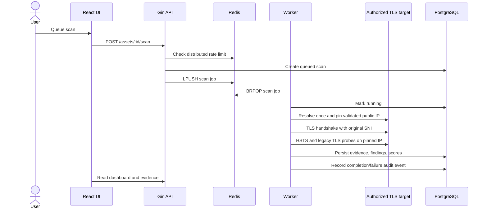

# QuantumField Architecture

QuantumField uses service separation so HTTP request handling, durable storage, and network scanning can scale independently.

## Components

| Component | Responsibility |
|---|---|
| React + TypeScript frontend | Analyst workflows, inventory, evidence, reports |
| Go + Gin API | JWT auth, authorization, validation, rate limiting, REST responses |
| PostgreSQL | Users, assets, scans, certificates, findings, assessments, audit logs |
| Redis | Scan queue and distributed fixed-window rate-limit counters |
| Go worker | DNS-safe TLS/X.509 scanning, scoring, retry handling |
| Nginx | Static frontend serving and `/api` reverse proxy |
| Docker Compose | Local orchestration |
| GitHub Actions | Unit, race, integration, lint, and build validation |

## Scan flow

## DNS and SSRF controls

The worker resolves a hostname once per scan and validates the entire DNS answer set. A response is rejected when any address is private, loopback, unspecified, link-local, multicast, carrier-grade NAT, benchmark, documentation-only, or otherwise reserved.

The selected public IP is then reused for:

- the primary TLS handshake;
- TLS 1.0 and TLS 1.1 probes;
- the HTTPS/HSTS request.

The original hostname remains the TLS SNI value, HTTP `Host`, and certificate hostname-verification input. This closes the earlier gap where validation and connection performed separate DNS resolutions.

## Queue and retry model

Each scan stores:

- `retry_count`;
- `max_retries`;
- `last_error`;
- `failed_at`;
- `completed_at`.

Failed scans are requeued immediately until the configured retry bound is reached. A terminal failure persists the structured error text, updates the asset state, and creates a `SCAN_FAILED` audit event. A production deployment may replace immediate retries with delayed exponential backoff and a dedicated dead-letter queue.

## Database migrations

Ordered SQL files in `backend/migrations` are embedded into the Go binary. Startup creates `schema_migrations`, applies unapplied files transactionally, and records each version. This provides repeatable schema setup without GORM auto-migration.

## Audit model

Audit records capture action, user, entity, source IP, user agent, details, and timestamp. Current events cover:

- login success and failure;
- account registration;
- asset creation;
- scan queueing;
- scan completion and terminal failure;
- report export.

## Trust boundaries

- Browser input is untrusted and validated by the API.
- JWT identity is required for user-scoped data.
- Redis and PostgreSQL are trusted application dependencies and must be isolated in deployment.
- Public targets are untrusted network peers.
- Scanning authorization remains an organizational/user responsibility.

